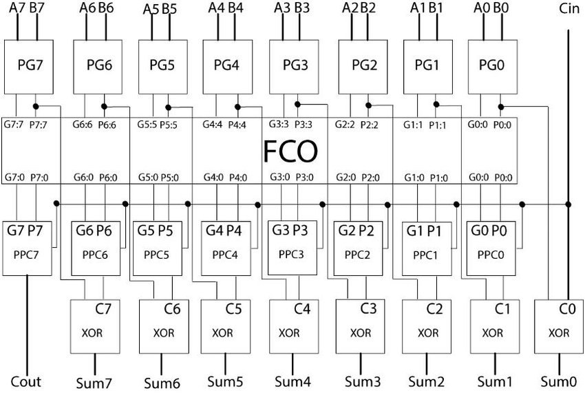
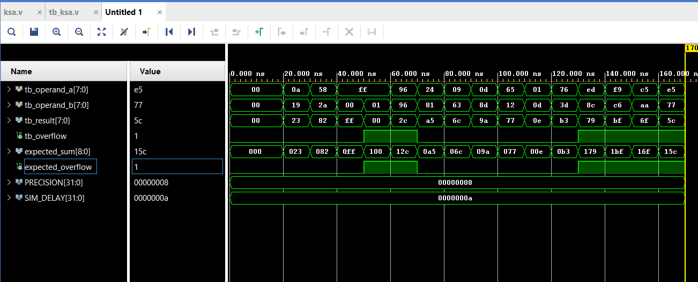
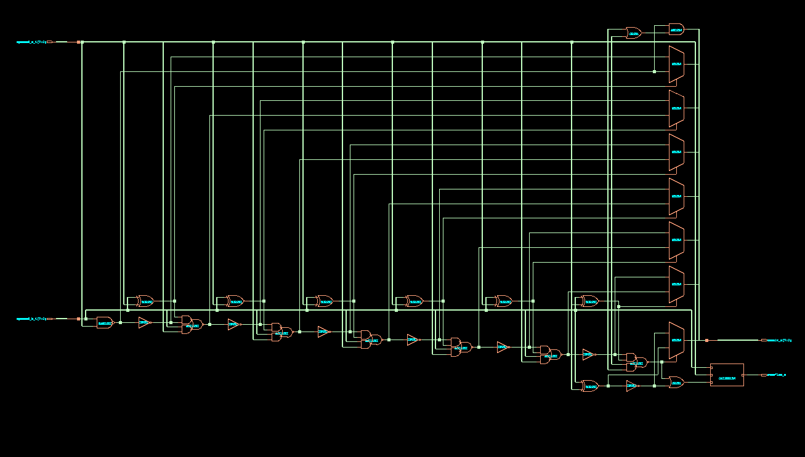
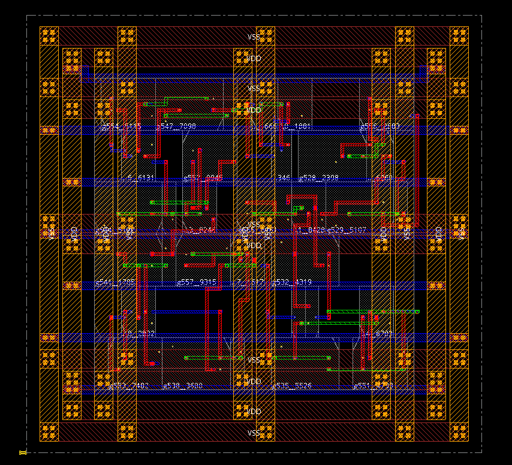
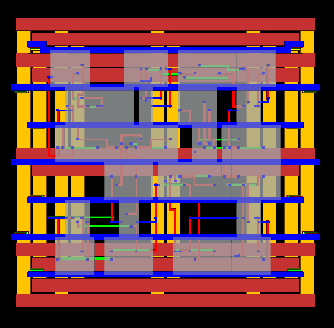
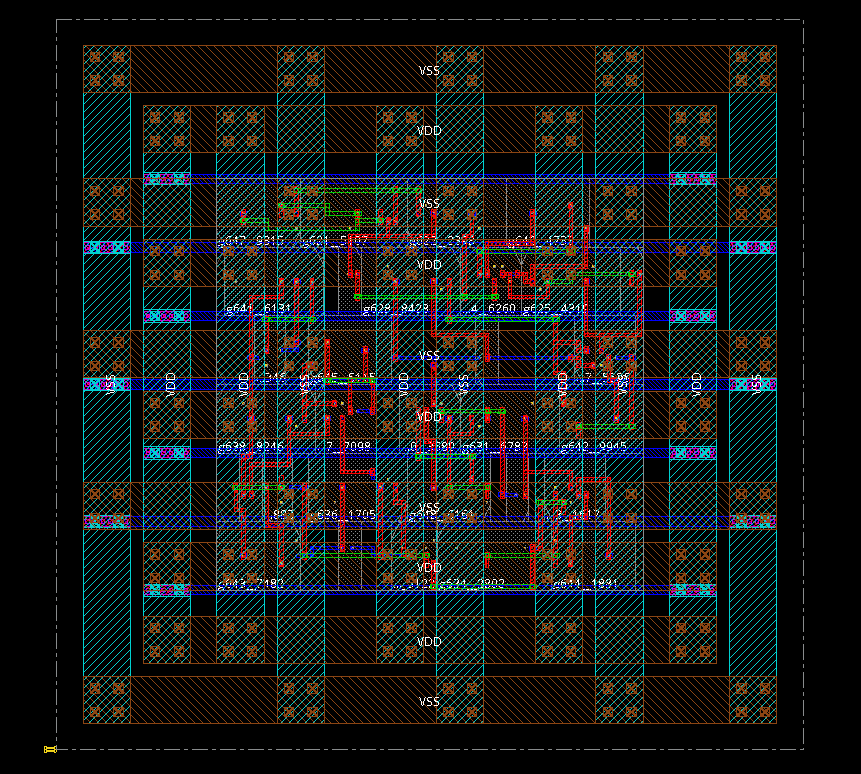

# ⚡ 8-Bit Kogge-Stone Adder: RTL to GDSII

*A high-performance parallel prefix adder implementing complete ASIC design flow*

[Overview](#-overview) • [Architecture](#-architecture) • [Results](#-results) • [Getting Started](#-getting-started) • [Documentation](#-documentation)

---

## 🎯 Overview

This project presents a *complete RTL-to-GDSII implementation* of an 8-bit Kogge-Stone Adder, one of the fastest parallel prefix adder architectures used in modern high-performance computing systems. The design achieves *logarithmic delay complexity O(log₂n)* compared to linear delay O(n) in conventional ripple carry adders.

### ✨ Key Highlights

- 🚀 *Ultra-Fast Addition*: Logarithmic carry propagation with only 3 prefix stages
- 🎨 *Dual Technology*: Complete implementation in both 90nm and 180nm CMOS
- ⚙ *Parameterized Design*: Scalable Verilog RTL with configurable precision
- 🔬 *Full Verification*: Comprehensive testbench with self-checking assertions
- 🏭 *Production Ready*: DRC/LVS clean layout ready for fabrication
- 📊 *Optimized Performance*: 2.05ns critical path delay at 90nm technology

---

## 🏗 Architecture

### Design Hierarchy

The Kogge-Stone Adder operates in three distinct stages:

┌─────────────────────────────────────────────────────────┐
│                    INPUT OPERANDS                        │
│                    A[7:0]  B[7:0]                       │
└─────────────────┬───────────────────────────────────────┘
                  │
         ┌────────▼────────┐
         │  PRE-PROCESSING │  ◄── Generate (Gi) & Propagate (Pi)
         │     STAGE       │      Gi = Ai · Bi
         └────────┬────────┘      Pi = Ai ⊕ Bi
                  │
         ┌────────▼────────┐
         │ PREFIX NETWORK  │  ◄── Parallel Carry Computation
         │   (3 Levels)    │      Log₂(8) = 3 stages
         │   Level 1       │      Span: 2¹ = 2 bits
         │   Level 2       │      Span: 2² = 4 bits
         │   Level 3       │      Span: 2³ = 8 bits
         └────────┬────────┘
                  │
         ┌────────▼────────┐
         │ POST-PROCESSING │  ◄── Sum Generation
         │     STAGE       │      Si = Pi ⊕ Ci
         └────────┬────────┘
                  │
         ┌────────▼────────┐
         │    OUTPUTS      │
         │  SUM[7:0]       │
         │  OVERFLOW       │
         └─────────────────┘

### Prefix Operator

The core operation combines generate and propagate pairs:

(Gk, Pk) ◦ (Gj, Pj) = (Gk + Pk·Gj, Pk·Pj)

This associative operator enables parallel prefix computation across all bit positions.

---

## 📊 Results

### Performance Comparison

| Technology | Area (μm²) | Delay (ns) | Power (μW) | Cells |
|:----------:|:----------:|:----------:|:----------:|:-----:|
| *90nm*   | 176.36     | 2.05       | 21.93      | 30    |
| *180nm*  | 652.00     | TBD        | 85.80      | 39    |

### Post-Layout Metrics (90nm)

╔══════════════════════════════════════════╗
║        DESIGN SUMMARY - 90nm             ║
╠══════════════════════════════════════════╣
║  Die Area       : 791.13 μm²             ║
║  Core Area      : 176.36 μm²             ║
║  Utilization    : ~22.3%                 ║
║  Critical Path  : 5.97 ns (post-layout)  ║
║  Total Power    : 25.08 μW               ║
║  Technology     : 90nm CMOS              ║
╚══════════════════════════════════════════╝

### Post-Layout Metrics (180nm)

╔══════════════════════════════════════════╗
║        DESIGN SUMMARY - 180nm            ║
╠══════════════════════════════════════════╣
║  Die Area       : 1881.9 μm²             ║
║  Die Dimensions : 44.22 x 42.56 μm²      ║
║  Core Area      : 652.00 μm² (synth)     ║
║  Maximum Delay  : TBD ns (post-layout)   ║
║  Total Power    : 85.8 μW                ║
║  Technology     : 180nm CMOS             ║
╚══════════════════════════════════════════╝

### Synthesis Results (90nm)

- ✅ *Timing Clean*: All paths meet timing constraints
- ✅ *DRC Clean*: Zero design rule violations
- ✅ *LVS Clean*: Layout matches schematic perfectly
- ✅ *Power Optimized*: Low leakage with efficient switching

---

## 🖼 Visual Gallery

### RTL Simulation Waveforms

Functional verification showing correct addition and overflow detection

### Gate-Level Schematic

| 180nm Technology | 90nm Technology |
|:----------------:|:---------------:|
|  |  |

### Physical Layout

#### 180nm Implementation

Complete routed layout with 2D and 3D views

#### 90nm Implementation

Optimized layout showing improved density and routing

---

## 🚀 Getting Started

### Prerequisites

bash
# Required Tools
- Xilinx Vivado (for simulation)
- Cadence Genus (for synthesis)
- Cadence Innovus (for place & route)
- 90nm/180nm CMOS standard cell libraries

### Quick Start

1. *Clone the repository*
   bash
   git clone https://github.com/upadhyaypranjal/8-Bit-Kogge-Stone-Adder.git
   cd 8-Bit-Kogge-Stone-Adder
   

2. *Run RTL Simulation*
   bash
   cd rtl
   # Open Vivado and source the simulation script
   vivado -mode batch -source sim_kogge_stone.tcl
   

3. *Synthesize the Design*
   bash
   cd synthesis
   genus -f run_synthesis.tcl
   

4. *Run Place & Route*
   bash
   cd pnr
   innovus -init run_innovus.tcl
   

---

---

## 🔬 Technical Specifications

### RTL Features

- *Parameterized Design*: Configurable PRECISION parameter for any bit-width
- *Automatic Stage Calculation*: Uses clog2 function to compute prefix stages
- *Overflow Detection*: Dedicated overflow flag for arithmetic operations
- *Fully Synthesizable*: Clean RTL without simulation-only constructs

### Design Metrics

| Parameter | Value | Description |
|-----------|-------|-------------|
| Bit Width | 8 | Default precision (configurable) |
| Prefix Stages | 3 | log₂(8) stages for 8-bit operation |
| Logic Depth | O(log₂n) | Theoretical delay complexity |
| Fan-out | Bounded | Consistent across all stages |
| Wiring Complexity | High | Dense interconnect network |

---

## 🎓 Academic Context

### Course Information

- *Course*: VLSI System Design (EC-307)
- *Faculty*: Dr. P. Ranga Babu, Department of ECE - IIITDM Kurnool
- *Date*: October 18, 2025

### Learning Outcomes

✓ Complete ASIC design flow from specification to layout  
✓ RTL coding and functional verification using Verilog  
✓ Logic synthesis and technology mapping  
✓ Physical design including floorplanning and routing  
✓ Timing analysis and power optimization  
✓ Design rule checking and layout versus schematic verification  

---

## 📚 References

1. *A. K. Sahu and D. S. Kushwah, "A Review on Different Parallel Prefix Adders for High Speed and Low Power Applications," *International Journal of Scientific Research and Engineering Trends (IJSRET), vol. 9, no. 4, pp. 317-321, Jul.-Aug. 2023.

2. *A. Mishra and N. Sharma, "Design and Performance Analysis of 64-bit Kogge Stone Adder using GDI and FinFET Technique," *International Research Journal of Engineering and Technology (IRJET), vol. 7, no. 3, pp. 4185-4190, Mar. 2020.

3. *ElProCus*, "Kogge Stone Adder: Circuit, Design, Advantages & Its Applications," [Online]. Available: https://www.elprocus.com/kogge-stone-adder/

---

## 🛠 Tools & Technologies

| Category | Tools |
|:--------:|:------|
| *HDL* | Verilog HDL |
| *Simulation* | Xilinx Vivado |
| *Synthesis* | Cadence Genus |
| *Place & Route* | Cadence Innovus |
| *Technology* | 90nm & 180nm CMOS Libraries |
| *Verification* | Custom Testbench, DRC, LVS |

---

## 🤝 Contributing

Contributions are welcome! If you'd like to improve this project:

1. Fork the repository
2. Create a feature branch (git checkout -b feature/AmazingFeature)
3. Commit your changes (git commit -m 'Add some AmazingFeature')
4. Push to the branch (git push origin feature/AmazingFeature)
5. Open a Pull Request

---

## 📝 License

This project is licensed under the MIT License - see the [LICENSE](LICENSE) file for details.

---

## 📬 Contact

*Pranjal Upadhyay*

- 📧 Email: pranjal2004upadhyay@gmail.com
- 💼 LinkedIn: https://www.linkedin.com/in/pranjalupadhyay0142
- 🐱 GitHub: https://github.com/upadhyaypranjal

---

## 🌟 Acknowledgments

- *Dr. P. Ranga Babu* - Course Instructor and Project Guide
- *IIITDM Kurnool* - For providing resources and infrastructure
- *Cadence Design Systems* - For EDA tool access
- *Open Source Community* - For various learning resources

---

---

## 👨‍🎓 About the Author

*Pranjal Upadhyay*  
Roll No: 523EC0012

*Department of Electronics and Communication Engineering*  
Integrated B.Tech and M.Tech Program

*Indian Institute of Information Technology Design and Manufacturing, Kurnool*

---

### ⭐ Star this repository if you found it helpful!

*Made with ❤ for VLSI enthusiasts*

---

© 2025 Pranjal Upadhyay. All Rights Reserved.

